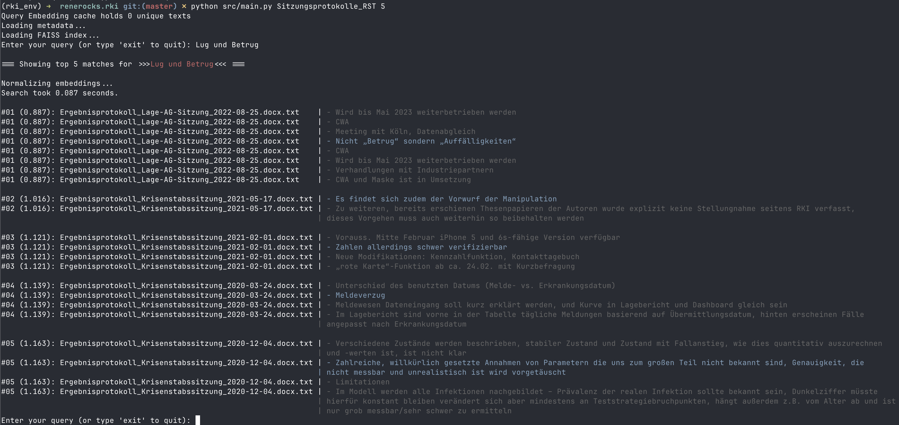

# renerocks.rki

## [FAISS](https://github.com/facebookresearch/faiss)-Powered Semantic Search over RKI Protocol Leak

This is an ad-hoc research project to test the feasibility of the approach of
using FAISS for semantic search in German texts.



## WARNING: Alpha Software: currently more suitable for tinkerers and enthusiasts


### Key points:

- [OpenAI
  Embeddings](https://platform.openai.com/docs/guides/embeddings/what-are-embeddings) (model=text-embedding-3-large)
- [FAISS](https://github.com/facebookresearch/faiss) Index Search (Cosine Distance Similarity Search)


This tool requires:

- an API key from OpenAI
- the following tools to convert everything into plain-text:
    - pandoc
    - poppler-utils (apt) / poppler (brew)
    - unrtf
    - libemail-outlook-message-perl (apt) / cpanm Email::Outlook::Message (cpanm
      for macos)
- python3 and a few packages

## Why an OpenAI API Key?

- Initially, all texts need to be converted into embeddings (approx. 30-40 min
  for the entire Zusatzmaterial-2020-2023.zip)
- Each search query needs to be converted into embeddings
    - however, the embeddings are cached
    - each repeated search query with the exact same wording does not require
      further conversion.
- Cost for Sitzungsprotokolle embeddings: $0.13 / 1M tokens
    - we have 51,672 paragraphs
    - 2.016 million tokens in total
    - that makes approx. 0.26 USD
- Cost for Zusatzmaterial embeddings: $0.13 / 1M tokens
    - we have 419,946 paragraphs
    - 12,944,836 tokens = 13 million tokens in total
    - that makes approx. 1.70 USD

## Quickstart

```shell
# ONE-TIME: download leak into ./data , e.g.: Zusatzmaterial-2020-2023.zip
$ mkdir data 
$ # do the download from a leak-mirror near you...
$ cd data
$ unzip Zusatzmaterial-2020-2023.zip
$ cd ..

# ONE-TIME: Optionally: Create a Python environment
$ python3 -m venv env
$ source env/bin/activate

# ONE-TIME: Install Python packages
$ pip install -f requirements.txt

# ONE-TIME: Create Dataset
# convert everything into plain-text
$ python src/convert.py ./data/Sitzungsprotokolle_orig_docx
$ python src/preprocess.py ./data/Sitzungsprotokolle_orig_docx sitzungsprotokolle

# Obtain an API key from OpenAI.
$ export OPENAI_RKI_KEY=xxxxx-xxxxx-xxxxx-xxx

# Start a search query on new dataset, show 30 results
$ python main.py sitzungsprotokolle 30
```

## On Pre-Processing
During pre-processing, the embeddings are fetched from OpenAI. This takes about
30 to 40 minutes for the 10GB Zusatzmaterial dataset.

After that, a [FAISS](https://github.com/facebookresearch/faiss) index for the
search needs to be created from all embeddings. This also takes some time,
depending on the CPU. Savvy programmers with an NVIDIA GPU can adjust the code
to use the GPU variant of FAISS. It should be much faster.

Once the index is calculated, it is saved and ready to be queried in main.py

