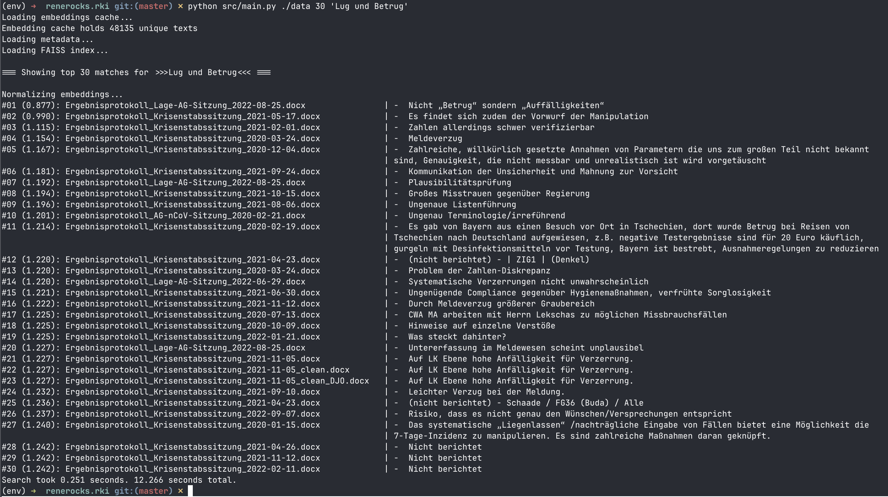

# renerocks.rki

## [FAISS](https://github.com/facebookresearch/faiss)-Powered Semantic Search over RKI Protocols

This is an ad-hoc research project to test the feasibility of the approach of
using FAISS for semantic search in German texts.



## WARNING: Alpha Software: currently more suitable for tinkerers and enthusiasts

(Currently, the generation of embeddings is still running on my end. So, I can't
even confirm that the program runs properly).

Key points:

- OpenAI Embeddings (model=text-embedding-3-large)
- FAISS Index Search (Cosine Distance Similarity Search)


This tool requires:

- an API key from OpenAI
- the tool `pandoc` to convert Word DOCX files into RST format
- python3 and a few packages

## Why an OpenAI API Key?

- Initially, all texts need to be converted into embeddings (approx. 10h)
- Each search query needs to be converted into embeddings
    - however, the embeddings are cached
    - each repeated search query with the exact same wording does not require
      further conversion.
- Cost for embeddings: $0.13 / 1M tokens
    - we have 88,009 paragraphs with a mean of 39 tokens per paragraph
    - that makes approx. 3.5 million tokens in total
    - that makes approx. 0.5 USD in total

## Quickstart

```shell
# ONE-TIME: download into ./data Sitzungsprotokolle_orig_docx.zip
$ cd data
$ unzip Sitzungsprotokolle_orig_docx.zip

# ONE-TIME: Convert texts into RST format
$ ./generate_txt.sh
$ cd ..

# Obtain an API key from OpenAI.
$ export OPENAI_RKI_KEY=xxxxx-xxxxx-xxxxx-xxx

# ONE-TIME: Optionally: Create a Python environment
$ python3 -m venv env
$ source env/bin/activate # on macos

# ONE-TIME: Install Python packages
$ pip install -f requirements.txt

# Start a search query
$ python main.py "search query"
```

At the first start, the embeddings are fetched from OpenAI. This takes about 10
hours.

After that, a [FAISS](https://github.com/facebookresearch/faiss) index for the
search needs to be created from all embeddings. This also takes some time,
depending on the CPU. Savvy programmers with an NVIDIA GPU can adjust the code
to use the GPU variant of FAISS. It should be much faster.

Once the index is calculated, it is saved and reloaded on the next program
start. It does not need to be recalculated.

